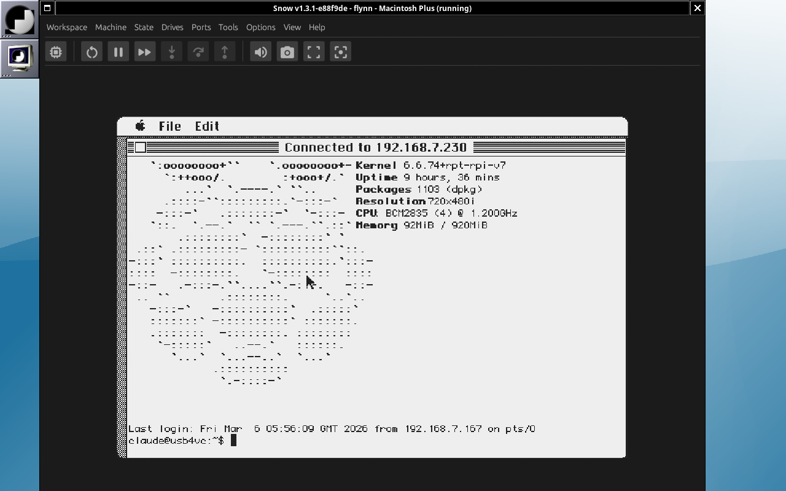

# Flynn

A Telnet client for classic Macintosh (68000/Mac Plus), targeting System 6.0.8 with MacTCP 2.1. Cross-compiled on Linux using [Retro68](https://github.com/autc04/Retro68).

This project was 100% vibe coded using [Claude Code](https://docs.anthropic.com/en/docs/claude-code)
with [Claude Code Teams](https://docs.anthropic.com/en/docs/claude-code/teams) orchestration.
[Read the development journal](JOURNAL.md) — from first build to full VT220 terminal emulator,
built entirely through agentic AI development.



---

[Features](#features) | [Current Status](#current-status) | [Keyboard Shortcuts](#keyboard-shortcuts) | [Building](#building) | [Testing](#testing) | [Acknowledgments](#acknowledgments) | [License](#license)

---

## Features

- Client-side Telnet protocol with IAC negotiation (BINARY, ECHO, SGA, TTYPE, NAWS)
- VT220 terminal emulation with xterm compatibility (TERM=xterm)
- DEC Special Graphics box-drawing via QuickDraw (tmux, mc, dialog borders)
- UTF-8 support: accented characters, box-drawing, curly quotes, symbols
- Alternate screen buffer for full-screen apps (vi, nano, less, tmux)
- Session bookmarks (up to 8, one-click connect from menu)
- Font selection (Monaco 9/12, Courier 10, Chicago 12, Geneva 9/10)
- Resizable terminal window with grow box (up to 132x50 cells)
- MacTCP networking for TCP/IP connectivity
- Scrollback viewing with Cmd+Up/Down keyboard navigation (96 lines)
- Mouse-based text selection (click-drag, double-click word, shift-click extend)
- Copy/paste via Mac clipboard (Cmd+C copies selection or full screen, Cmd+V to paste)
- Settings persistence (host/port, bookmarks, font saved across launches)
- Option key as Ctrl modifier for M0110 keyboard
- Cmd+. sends Escape (classic Mac convention), Clear key also sends Escape
- F1-F12 via Cmd+1..0 for M0110 keyboards, native ADB F-key support
- Application cursor keys and keypad mode for vi/tmux navigation
- Bracketed paste mode support
- Targets Motorola 68000 CPU (Mac Plus compatible)

## Current Status

Version 0.11.1 — Phases 0-15 complete. Flynn is a fully featured telnet client with VT220/xterm terminal emulation, UTF-8 support, session bookmarks, resizable windows, and 6 font choices. It connects to modern Linux telnetd servers, renders full-screen TUI applications (nano, vi, tmux, mc), handles interactive shell sessions with mouse text selection, copy/paste and scrollback viewing, and saves all preferences across launches. Ships with a custom Finder icon, TeachText Read Me documentation, and BinHex archive for cross-platform distribution. The application runs on a Macintosh Plus with 4MB RAM under System 6.0.8 with MacTCP 2.1.

## Keyboard Shortcuts

Flynn is designed for the Apple M0110/M0110A keyboard, which lacks Escape and Control keys. These mappings also work on modern USB/ADB keyboards.

| Action | Keys | Notes |
|--------|------|-------|
| Escape | Cmd+. | Classic Mac "Cancel" convention |
| Escape | Clear (keypad) | M0110A numeric keypad key |
| Escape | Esc key | Modern keyboards only (not on M0110) |
| Ctrl+key | Option+key | e.g., Option+C = Ctrl+C |
| Scroll up/down | Cmd+Up/Down | One line at a time |
| Scroll page | Cmd+Shift+Up/Down | One page at a time |
| Select text | Click+drag | Stream selection with inverse video |
| Select word | Double-click | Selects contiguous non-space word |
| Extend selection | Shift+click | Extends selection to click point |
| Copy | Cmd+C | Copies selection, or full screen if none |
| Paste | Cmd+V | Sends clipboard to connection |
| F1-F10 | Cmd+1..0 | For M0110 keyboards without function keys |
| Bookmarks | Cmd+B | Open bookmark manager |
| Connect | Cmd+N | Open connect dialog |

## Building

Requires the [Retro68](https://github.com/autc04/Retro68) cross-compilation toolchain. Build it from source (68k only):

```bash
git clone https://github.com/autc04/Retro68.git
cd Retro68 && git submodule update --init && cd ..
mkdir Retro68-build && cd Retro68-build
bash ../Retro68/build-toolchain.bash --no-ppc --no-carbon --prefix=$(pwd)/toolchain
```

Then build Flynn:

```bash
./build.sh
```

## Testing

Uses [Snow](https://snowemu.com/) emulator (v1.3.1) with a Mac Plus ROM and System 6.0.8 SCSI hard drive image. Snow supports DaynaPORT SCSI/Link Ethernet emulation for MacTCP networking. The emulator can be fully automated via X11 for unattended testing. See `docs/TESTING.md` for details.

## Acknowledgments

- **[Claude Code](https://claude.ai/code)** — AI-assisted development by [Anthropic](https://www.anthropic.com/). Flynn was built entirely through agentic AI pair programming.
- **[Retro68](https://github.com/autc04/Retro68)** by Wolfgang Thaller — the 68k Macintosh cross-compilation toolchain that makes building classic Mac applications on modern Linux possible.
- **[Snow](https://snowemu.com/)** — a Rust-based classic Macintosh emulator with low-level hardware emulation, DaynaPORT SCSI/Link networking, and BlueSCSI Toolbox support. Used for all development testing.
- **[wallops](https://github.com/jcs/wallops)** by joshua stein — IRC client for classic Macintosh. MacTCP wrapper (`tcp.c`/`tcp.h`), DNS resolution (`dnr.c`/`dnr.h`), utility functions (`util.c`/`util.h`), and `MacTCP.h` are used directly from this project. ISC license.
- **[subtext](https://github.com/jcs/subtext)** by joshua stein — BBS server for classic Macintosh. The Telnet IAC protocol implementation (`telnet.c`/`telnet.h`) served as the reference for Flynn's client-side telnet engine. ISC license.

## License

ISC License. See [LICENSE](LICENSE) for full details.
