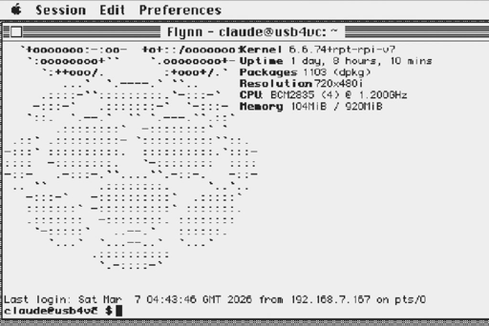
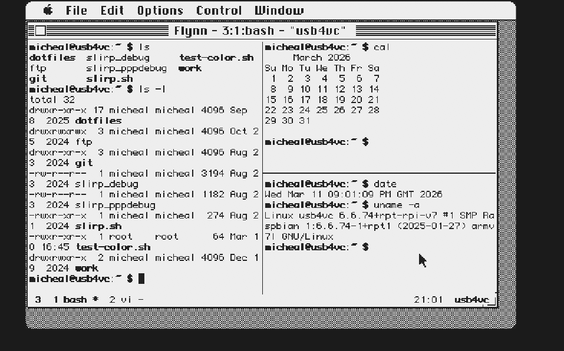
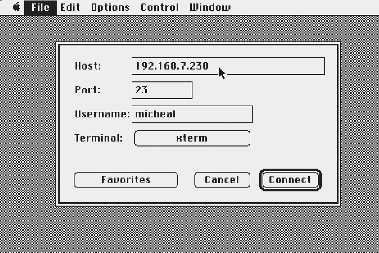
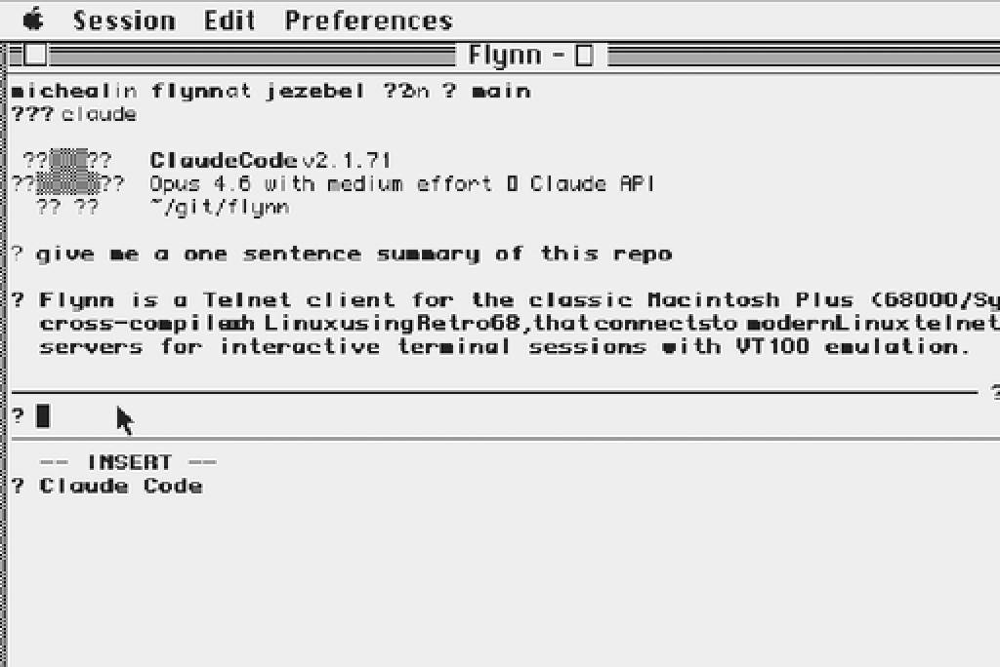

# Flynn

A Telnet client for classic Macintosh (68000/Mac Plus), targeting System 6.0.8 with MacTCP 2.1. Also tested on System 7.5.5 with Open Transport. Cross-compiled on Linux using [Retro68](https://github.com/autc04/Retro68).

This project was 100% vibe coded using [Claude Code](https://docs.anthropic.com/en/docs/claude-code).

<p align="center">
<a href="#download">Download</a> · <a href="#features">Features</a> · <a href="#keyboard-shortcuts">Keyboard Shortcuts</a> · <a href="#building">Building</a> · <a href="#testing">Testing</a> · <a href="#acknowledgments">Acknowledgments</a> · <a href="#license">License</a>
</p>

| | |
|:---:|:---:|
|  |  |
| **Telnet Session** | **tmux Split Panes** |
|  |  |
| **Connect Dialog** | **Claude Code via Flynn** |

---

## Download

Pre-built binaries are available on the [Releases](https://github.com/ecliptik/flynn/releases) page, [Macintosh Garden](https://macintoshgarden.org/apps/flynn), and [Macintosh Repository](https://www.macintoshrepository.org/87841-flynn):

- **Flynn-x.y.z.dsk** — 800K floppy disk image
- **Flynn-x.y.z.hqx** — BinHex archive

No build toolchain required — just download and run.

## Features

- **VT100/VT220/xterm terminal emulation**
- **Box-drawing characters**
- **Unicode glyph rendering**
- **Resizable window** (80x24 up to 132x50)
- **6 fonts** (Monaco 9/12, Courier 10, Chicago 12, Geneva 9/10)
- **Session bookmarks**
- **Username auto-login**
- **Mouse text selection**
- **Scrollback** (96 lines)
- **Control menu**
- **Keystroke buffering**
- **M0110 keyboard support**
- **Dark mode**
- **Settings persistence**
- **4MB Mac Plus** (~110KB on disk, ~60KB RAM)

## Keyboard Shortcuts

Flynn is designed for the Apple M0110/M0110A keyboard, which lacks Escape and Control keys. These mappings also work on modern USB/ADB keyboards.

| Action | Keys | Notes |
|--------|------|-------|
| Escape | Cmd+. | Classic Mac "Cancel" convention |
| Escape | Clear (keypad) | M0110A numeric keypad key |
| Escape | Esc key | Modern keyboards only (not on M0110) |
| Ctrl+key | Option+key | e.g., Option+C = Ctrl+C |
| Scroll up/down | Cmd+Up/Down | One line at a time |
| Scroll page | Cmd+Shift+Up/Down | One page at a time |
| Select text | Click+drag | Stream selection with inverse video |
| Select word | Double-click | Selects contiguous non-space word |
| Extend selection | Shift+click | Extends selection to click point |
| Copy | Cmd+C | Copies selection, or full screen if none |
| Paste | Cmd+V | Sends clipboard to connection |
| F1-F10 | Cmd+1..0 | For M0110 keyboards without function keys |
| Bookmarks | Cmd+B | Open bookmark manager |
| Connect | Cmd+N | Open connect dialog |

## Building

Requires the [Retro68](https://github.com/autc04/Retro68) cross-compilation toolchain. Build it from source (68k only):

```bash
git clone https://github.com/autc04/Retro68.git
cd Retro68 && git submodule update --init && cd ..
mkdir Retro68-build && cd Retro68-build
bash ../Retro68/build-toolchain.bash --no-ppc --no-carbon --prefix=$(pwd)/toolchain
```

Then build Flynn:

```bash
./scripts/build.sh
```

## Testing

Uses [Snow](https://snowemu.com/) emulator (v1.3.1) with a Mac Plus ROM and System 6.0.8 SCSI hard drive image. Snow supports DaynaPORT SCSI/Link Ethernet emulation for MacTCP networking. The emulator can be fully automated via X11 for unattended testing. See `docs/TESTING.md` for details.

## Acknowledgments

- **[Claude Code](https://claude.ai/code)** by [Anthropic](https://www.anthropic.com/)
- **[Retro68](https://github.com/autc04/Retro68)** by Wolfgang Thaller
- **[Snow](https://snowemu.com/)** emulator
- **[wallops](https://github.com/jcs/wallops)** by joshua stein — MacTCP wrapper (`tcp.c`/`tcp.h`), DNS resolution (`dnr.c`/`dnr.h`), utility functions (`util.c`/`util.h`), and `MacTCP.h` are used directly from this project. ISC license.
- **[subtext](https://github.com/jcs/subtext)** by joshua stein — The Telnet IAC protocol implementation (`telnet.c`/`telnet.h`) served as the reference for Flynn's client-side telnet engine. ISC license.

## License

ISC License. See [LICENSE](LICENSE) for full details.
