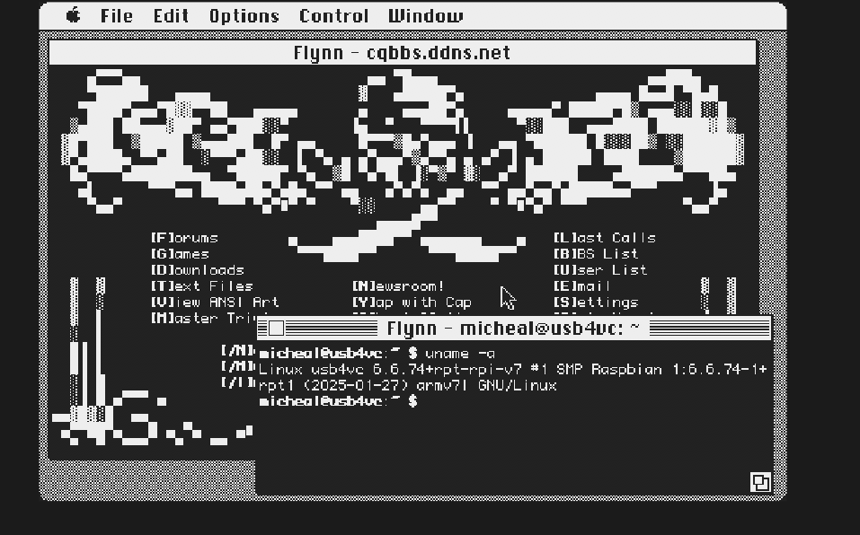
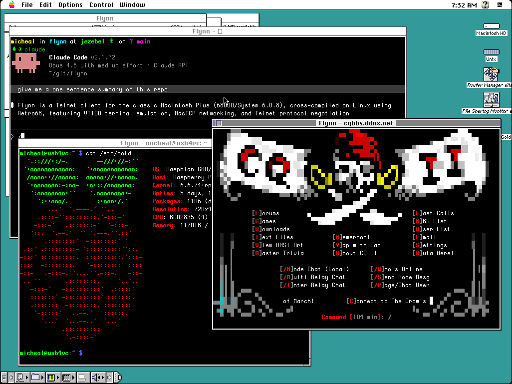

# Flynn

A Telnet client for classic 68000 Macintosh systems, from the Mac Plus and up. Supports monochrome on System 6 and 256 colors on System 7. Works with MacTCP and Open Transport's MacTCP compatibility layer. Cross-compiled on Linux using [Retro68](https://github.com/autc04/Retro68).

This project was 100% vibe coded using [Claude Code](https://docs.anthropic.com/en/docs/claude-code).

<p align="center">
<a href="#download">Download</a> · <a href="#features">Features</a> · <a href="#keyboard-shortcuts">Keyboard Shortcuts</a> · <a href="#building">Building</a> · <a href="#testing">Testing</a> · <a href="#acknowledgments">Acknowledgments</a> · <a href="#license">License</a>
</p>

### System 6

| | |
|:---:|:---:|
|  |  |
| **Telnet Session** | **tmux Split Panes** |
|  |  |
| **Connect Dialog** | **Multi-Session and ANSI-BBS** |

### System 7

<p align="center">

<br>
<strong>256-Color Multi-Session</strong>
</p>

---

## Download

Pre-built binaries are available on the [Releases](https://github.com/ecliptik/flynn/releases) page, [Macintosh Garden](https://macintoshgarden.org/apps/flynn), and [Macintosh Repository](https://www.macintoshrepository.org/87841-flynn):

- **Flynn-x.y.z.dsk** — 800K floppy disk image
- **Flynn-x.y.z.hqx** — BinHex archive

No build toolchain required — just download and run.

## Requirements

- Macintosh Plus or later (4MB RAM, 68000 CPU)
- System 6.0.8 or System 7 with MacTCP or Open Transport
- ~113KB disk space, ~72KB RAM per session (mono) / ~123KB (color)

## Features

**Terminal Emulation**
- **VT100/VT220/xterm/xterm-256color/ANSI-BBS terminal emulation** with CP437 rendering
- **256-color support** on System 7 with Color QuickDraw (zero System 6 impact)
- **SGR attributes**: bold, italic, underline, dim, strikethrough, blink, inverse
- **UTF-8 with box-drawing, Unicode glyphs, emoji, and Braille patterns** (213 glyphs + 19 emoji)
- **OSC support**: window title, palette and color queries

**Display & Windowing**
- **Multiple sessions** (up to 4 simultaneous windows)
- **Resizable window and scrollback** (80x24 up to 132x50)
- **6 fonts** (Monaco 9/12, Courier 10, Chicago 12, Geneva 9/10)
- **Dark mode**

**Input & Interaction**
- **Mouse text selection with copy/paste**
- **Bracketed paste mode**
- **M0110 keyboard support**
- **Keystroke buffering**
- **Backspace DEL/BS toggle** (auto-switches with terminal type)

**Session Management**
- **Session bookmarks**
- **Settings persistence**
- **MultiFinder, Apple Events, and Notification Manager support**

## Keyboard Shortcuts

Flynn is designed for the Apple M0110/M0110A keyboard, which lacks Escape and Control keys. These mappings also work on modern USB/ADB keyboards.

| Action | Keys | Notes |
|--------|------|-------|
| Escape | Cmd+. | Classic Mac "Cancel" convention |
| Escape | Clear (keypad) | M0110A numeric keypad key |
| Escape | Esc key | Modern keyboards only (not on M0110) |
| Ctrl+key | Option+key | e.g., Option+C = Ctrl+C |
| Scroll up/down | Cmd+Up/Down | One line at a time |
| Scroll page | Cmd+Shift+Up/Down | One page at a time |
| Select text | Click+drag | Stream selection with inverse video |
| Select word | Double-click | Selects contiguous non-space word |
| Extend selection | Shift+click | Extends selection to click point |
| Copy | Cmd+C | Copies selection, or full screen if none |
| Paste | Cmd+V | Sends clipboard to connection |
| Select All | Cmd+A | Selects entire terminal screen |
| F1-F10 | Cmd+1..0 | For M0110 keyboards without function keys |
| Bookmarks | Cmd+B | Open bookmark manager |
| New Session | Cmd+N | New session (new window if connected) |
| Save Contents | Cmd+S | Save scrollback and screen to text file |
| Close Window | Cmd+W | Close active session window |
| Quit | Cmd+Q | Quit Flynn |

## Building

Requires the [Retro68](https://github.com/autc04/Retro68) cross-compilation toolchain. Build it from source (68k only):

```bash
git clone https://github.com/autc04/Retro68.git
cd Retro68 && git submodule update --init && cd ..
mkdir Retro68-build && cd Retro68-build
bash ../Retro68/build-toolchain.bash --no-ppc --no-carbon --prefix=$(pwd)/toolchain
```

Then build Flynn:

```bash
./scripts/build.sh
```

## Testing

Uses [Snow](https://snowemu.com/) emulator (v1.3.1) with a Mac Plus ROM and System 6.0.8 SCSI hard drive image. Snow supports DaynaPORT SCSI/Link Ethernet emulation for MacTCP networking. The emulator can be fully automated via X11 for unattended testing. See `docs/TESTING.md` for details.

## Acknowledgments

- **[Claude Code](https://claude.ai/code)** by [Anthropic](https://www.anthropic.com/)
- **[Retro68](https://github.com/autc04/Retro68)** by Wolfgang Thaller
- **[Snow](https://snowemu.com/)** emulator
- **[wallops](https://github.com/jcs/wallops)** by joshua stein — MacTCP wrapper (`tcp.c`/`tcp.h`), DNS resolution (`dnr.c`/`dnr.h`), utility functions (`util.c`/`util.h`), and `MacTCP.h` are used directly from this project. ISC license.
- **[subtext](https://github.com/jcs/subtext)** by joshua stein — The Telnet IAC protocol implementation (`telnet.c`/`telnet.h`) served as the reference for Flynn's client-side telnet engine. ISC license.

## License

ISC License. See [LICENSE](LICENSE) for full details.
